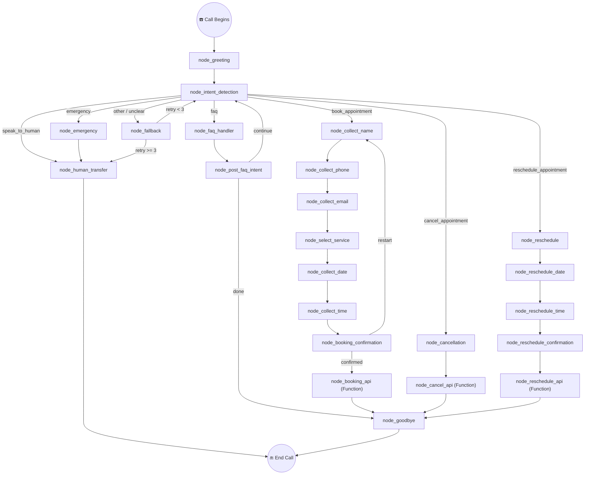

# RetellAI Conversational Flow — QuensultingAI Dental Clinic

> **Phase 2 Deliverable** — Complete conversation design for a production-ready AI voice receptionist.
> This document is the blueprint for building the flow inside the RetellAI Conversation Flow canvas.

---

## Table of Contents

1. [Agent Identity & Global Configuration](#1-agent-identity--global-configuration)
2. [Dynamic Variables](#2-dynamic-variables)
3. [High-Level Flow Architecture](#3-high-level-flow-architecture)
4. [Node-by-Node Specification](#4-node-by-node-specification)
5. [Branching & Transition Logic](#5-branching--transition-logic)
6. [Validation Rules](#6-validation-rules)
7. [Error Recovery & Fallback Strategy](#7-error-recovery--fallback-strategy)
8. [Human Transfer Logic](#8-human-transfer-logic)
9. [Test Scenarios](#9-test-scenarios)

---

## 1. Agent Identity & Global Configuration

### Agent Persona

| Field | Value |
|---|---|
| **Name** | Meera |
| **Role** | AI Receptionist |
| **Clinic** | QuensultingAI Dental Clinic |
| **Location** | Baner, Pune |
| **Tone** | Warm, professional, concise |
| **Language** | English (with Indian English conventions) |

### Global System Prompt (applied to all Conversation Nodes)

```
You are Meera, the AI receptionist for QuensultingAI Dental Clinic in Baner, Pune.

Style Guardrails:
- Use short, spoken sentences (1–2 sentences max per turn).
- Never use bullet points, numbered lists, or markdown — this is a voice call.
- Be warm but efficient. Do not over-explain.
- If the caller interrupts, acknowledge their input and adjust immediately.
- Never fabricate information. If unsure, offer to transfer to the front desk.

Clinic Facts:
- Working hours: Monday to Saturday, 9 AM to 6 PM. Closed on Sundays.
- Consultation fee: ₹500 (Rupees five hundred).
- Payment methods: Cash, UPI, Credit Card, Debit Card.
- Walk-ins are accepted but appointments are recommended.
- Emergency appointments are subject to doctor availability.
- Address: QuensultingAI Dental Clinic, Baner, Pune.

Services offered:
- Dental Cleaning
- Root Canal Treatment
- Teeth Whitening
- Braces Consultation
- Tooth Extraction
- General Dental Consultation
```

### Interruption Handling (Global)

RetellAI supports native interruption detection. Configure the agent with:

| Setting | Value |
|---|---|
| **Interruption Sensitivity** | Medium-High |
| **Behaviour on Interrupt** | Stop speaking, process caller input, resume from current node context |
| **Backchannel** | Enabled (`hmm`, `okay`, `got it`) |

This ensures the agent never "restarts" the flow when interrupted — it absorbs the caller's words and continues within the current node's context.

---

## 2. Dynamic Variables

These variables are extracted and persisted across the flow. They are referenced as `{{variable_name}}` in prompts, transitions, and API payloads.

| Variable | Type | Extracted At | Description |
|---|---|---|---|
| `caller_intent` | Enum | `node_intent_detection` | Primary intent: `book_appointment`, `cancel_appointment`, `reschedule_appointment`, `faq`, `emergency`, `speak_to_human`, `other` |
| `caller_name` | Text | `node_collect_name` | Full name of the caller |
| `caller_phone` | Text | `node_collect_phone` | 10-digit Indian mobile number |
| `caller_email` | Text | `node_collect_email` | Email address |
| `selected_service` | Enum | `node_select_service` | One of the six dental services |
| `preferred_date` | Text | `node_collect_date` | Preferred appointment date |
| `preferred_time` | Text | `node_collect_time` | Preferred appointment time |
| `confirmation_status` | Enum | `node_booking_confirmation` | `confirmed` or `restart` |
| `cancel_reason` | Text | `node_cancellation_reason` | Reason for cancellation (optional) |
| `reschedule_new_date` | Text | `node_reschedule_date` | New preferred date |
| `reschedule_new_time` | Text | `node_reschedule_time` | New preferred time |
| `retry_count` | Number | Multiple nodes | Incremented on each failed extraction (max 3) |

---

## 3. High-Level Flow Architecture



---

## 4. Node-by-Node Specification

### Legend

| Icon | Node Type |
|---|---|
| 💬 | Conversation Node |
| 🔍 | Extract Dynamic Variable Node |
| 🔀 | Logic Node |
| ⚙️ | Function Node |
| 🔚 | End Node |

---

### 4.1 💬 `node_greeting`

**Type:** Conversation Node (Static Sentence)

**Prompt:**
```
Hello! Thank you for calling QuensultingAI Dental Clinic, Baner, Pune. I'm Meera, your AI assistant. How can I help you today?
```

**Transitions:**

| Condition | Target |
|---|---|
| *(default — caller responds)* | `node_intent_detection` |

---

### 4.2 🔍 `node_intent_detection`

**Type:** Extract Dynamic Variable Node

**Variable Extracted:** `caller_intent`

**Variable Config:**

| Field | Value |
|---|---|
| Name | `caller_intent` |
| Type | Enum |
| Values | `book_appointment`, `cancel_appointment`, `reschedule_appointment`, `faq`, `emergency`, `speak_to_human`, `other` |
| Description | Determine the caller's primary intent from their response. If they mention booking, scheduling, or making an appointment → `book_appointment`. If they want to cancel → `cancel_appointment`. If they want to change/move an existing appointment → `reschedule_appointment`. If they ask about hours, location, services, fees, or payment → `faq`. If they mention pain, bleeding, swelling, or urgent dental issue → `emergency`. If they explicitly ask to speak to a person/human/receptionist → `speak_to_human`. Otherwise → `other`. |

**Prompt:**
```
(No agent speech — this node silently analyses the caller's previous utterance from the greeting.)
```

**Transitions:**

| Condition (Equation-based) | Target |
|---|---|
| `{{caller_intent}} == "book_appointment"` | `node_collect_name` |
| `{{caller_intent}} == "cancel_appointment"` | `node_cancellation` |
| `{{caller_intent}} == "reschedule_appointment"` | `node_reschedule` |
| `{{caller_intent}} == "faq"` | `node_faq_handler` |
| `{{caller_intent}} == "emergency"` | `node_emergency` |
| `{{caller_intent}} == "speak_to_human"` | `node_human_transfer` |
| `{{caller_intent}} == "other"` | `node_fallback` |

---

### 4.3 💬 `node_faq_handler`

**Type:** Conversation Node (Prompt mode — flex)

**Prompt:**
```
Answer the caller's question using only the clinic facts provided in the system prompt. Keep answers to one or two sentences. If the question is outside clinic scope, say: "I'm not sure about that, but I can connect you with our front desk."

After answering, ask: "Is there anything else I can help you with?"
```

**Transitions:**

| Condition (Prompt-based) | Target |
|---|---|
| Caller wants to book, cancel, reschedule, or has another request | `node_intent_detection` |
| Caller says no / nothing else / goodbye | `node_goodbye` |

---

### 4.4 💬 `node_emergency`

**Type:** Conversation Node (Static Sentence)

**Prompt:**
```
I understand you're experiencing a dental emergency. I'm going to connect you with our clinic team right away so they can help you immediately. Please stay on the line.
```

**Transitions:**

| Condition | Target |
|---|---|
| *(default — skip response)* | `node_human_transfer` |

> **Configuration:** Enable "Skip Response" — the agent speaks the sentence and immediately transitions without waiting for caller input.

---

### 4.5 💬 `node_human_transfer`

**Type:** Conversation Node (Static Sentence) + Transfer action

**Prompt:**
```
I'm transferring you to our front desk now. Thank you for your patience, and have a great day!
```

**Transitions:**

| Condition | Target |
|---|---|
| *(default — skip response)* | `node_end_transfer` |

---

### 4.6 🔚 `node_end_transfer`

**Type:** End Node

**Configuration:**

| Field | Value |
|---|---|
| End behaviour | Transfer call to configured phone number |
| Transfer number | *(configured in RetellAI agent settings — clinic front desk)* |

---

### 4.7 💬 `node_fallback`

**Type:** Conversation Node (Prompt mode)

**Prompt:**
```
I'm sorry, I didn't quite catch that. I can help you with booking an appointment, cancelling or rescheduling an existing appointment, or answering questions about our clinic. What would you like to do?
```

**Pre-transition Logic:** Increment `{{retry_count}}` by 1.

**Transitions:**

| Condition | Target |
|---|---|
| `{{retry_count}} >= 3` (Equation) | `node_max_retries` |
| *(default — caller responds)* | `node_intent_detection` |

---

### 4.8 💬 `node_max_retries`

**Type:** Conversation Node (Static Sentence)

**Prompt:**
```
I'm having trouble understanding your request. Let me connect you with our team who can assist you better.
```

**Transitions:**

| Condition | Target |
|---|---|
| *(default — skip response)* | `node_human_transfer` |

---

### 4.9 💬 `node_collect_name`

**Type:** Conversation Node (Prompt mode)

**Prompt:**
```
Great, I'd be happy to help you book an appointment! May I have your full name, please?
```

**Transitions:**

| Condition (Prompt-based) | Target |
|---|---|
| Caller provides their name | `node_extract_name` |
| Caller wants to speak to a human | `node_human_transfer` |
| Caller asks to cancel instead | `node_cancellation` |

---

### 4.10 🔍 `node_extract_name`

**Type:** Extract Dynamic Variable Node

**Variable Extracted:** `caller_name`

| Field | Value |
|---|---|
| Name | `caller_name` |
| Type | Text |
| Description | Extract the caller's full name from their response. |

**Transitions:**

| Condition | Target |
|---|---|
| `{{caller_name}}` extracted successfully | `node_collect_phone` |
| Extraction failed | `node_collect_name` *(re-ask, increment retry)* |

---

### 4.11 💬 `node_collect_phone`

**Type:** Conversation Node (Prompt mode)

**Prompt:**
```
Thank you, {{caller_name}}. Could you share your phone number, please?
```

**Transitions:**

| Condition (Prompt-based) | Target |
|---|---|
| Caller provides a phone number | `node_extract_phone` |

---

### 4.12 🔍 `node_extract_phone`

**Type:** Extract Dynamic Variable Node

**Variable Extracted:** `caller_phone`

| Field | Value |
|---|---|
| Name | `caller_phone` |
| Type | Text |
| Description | Extract a 10-digit Indian mobile number from the caller's response. The number should contain exactly 10 digits and start with 6, 7, 8, or 9. Ignore spaces, dashes, and the country code +91 or 0 prefix if present. Store only the 10 digits. |

**Transitions:**

| Condition | Target |
|---|---|
| `{{caller_phone}}` extracted and is 10 digits | `node_validate_phone` |
| Extraction failed | `node_phone_retry` |

---

### 4.13 🔀 `node_validate_phone`

**Type:** Logic Node

**Conditions (evaluated top to bottom):**

| # | Condition (Equation) | Target |
|---|---|---|
| 1 | `len({{caller_phone}}) == 10` | `node_collect_email` |
| 2 | *(default)* | `node_phone_retry` |

> **Note:** RetellAI Logic Nodes evaluate equation conditions first. The length check ensures the extracted value is a valid 10-digit number.

---

### 4.14 💬 `node_phone_retry`

**Type:** Conversation Node (Prompt mode)

**Prompt:**
```
I need a valid 10-digit mobile number. Could you please repeat your phone number slowly?
```

**Pre-transition Logic:** Increment `{{retry_count}}` by 1.

**Transitions:**

| Condition | Target |
|---|---|
| `{{retry_count}} >= 3` (Equation) | `node_max_retries` |
| *(default — caller responds)* | `node_extract_phone` |

---

### 4.15 💬 `node_collect_email`

**Type:** Conversation Node (Prompt mode)

**Prompt:**
```
And your email address? We'll send the appointment confirmation there.
```

**Transitions:**

| Condition (Prompt-based) | Target |
|---|---|
| Caller provides an email | `node_extract_email` |
| Caller says they don't have email / skip | `node_select_service` *(set `caller_email` to empty)* |

---

### 4.16 🔍 `node_extract_email`

**Type:** Extract Dynamic Variable Node

**Variable Extracted:** `caller_email`

| Field | Value |
|---|---|
| Name | `caller_email` |
| Type | Text |
| Description | Extract the caller's email address. The value should contain an @ symbol and a domain. Common spoken patterns: "my email is john at gmail dot com" should be normalised to "john@gmail.com". |

**Transitions:**

| Condition | Target |
|---|---|
| `{{caller_email}}` extracted and contains `@` | `node_select_service` |
| Extraction failed | `node_email_retry` |

---

### 4.17 💬 `node_email_retry`

**Type:** Conversation Node (Prompt mode)

**Prompt:**
```
I didn't quite get that. Could you spell out your email address for me?
```

**Pre-transition Logic:** Increment `{{retry_count}}` by 1.

**Transitions:**

| Condition | Target |
|---|---|
| `{{retry_count}} >= 3` (Equation) | `node_skip_email` |
| *(default — caller responds)* | `node_extract_email` |

---

### 4.18 💬 `node_skip_email`

**Type:** Conversation Node (Static Sentence)

**Prompt:**
```
No worries, we can proceed without the email. Our team can collect it when you visit.
```

**Side effect:** Set `caller_email` = `""`.

**Transitions:**

| Condition | Target |
|---|---|
| *(default — skip response)* | `node_select_service` |

---

### 4.19 💬 `node_select_service`

**Type:** Conversation Node (Prompt mode)

**Prompt:**
```
What service are you looking for? We offer Dental Cleaning, Root Canal Treatment, Teeth Whitening, Braces Consultation, Tooth Extraction, and General Dental Consultation.
```

**Transitions:**

| Condition (Prompt-based) | Target |
|---|---|
| Caller selects a service | `node_extract_service` |
| Caller is unsure / asks for recommendation | `node_service_help` |

---

### 4.20 💬 `node_service_help`

**Type:** Conversation Node (Prompt mode)

**Prompt:**
```
If you're not sure, I'd recommend booking a General Dental Consultation. The doctor can evaluate your needs and suggest the right treatment. Shall I go ahead with that?
```

**Transitions:**

| Condition (Prompt-based) | Target |
|---|---|
| Caller agrees | `node_extract_service` *(set `selected_service` = `general_dental_consultation`)* |
| Caller picks a different service | `node_extract_service` |
| Caller wants to think / not sure | `node_goodbye` |

---

### 4.21 🔍 `node_extract_service`

**Type:** Extract Dynamic Variable Node

**Variable Extracted:** `selected_service`

| Field | Value |
|---|---|
| Name | `selected_service` |
| Type | Enum |
| Values | `dental_cleaning`, `root_canal_treatment`, `teeth_whitening`, `braces_consultation`, `tooth_extraction`, `general_dental_consultation` |
| Description | Map the caller's spoken service choice to one of the enum values. "Cleaning" → `dental_cleaning`. "Root canal" → `root_canal_treatment`. "Whitening" or "bleaching" → `teeth_whitening`. "Braces" or "aligners" → `braces_consultation`. "Extraction" or "pull a tooth" → `tooth_extraction`. "Consultation", "check-up", or "general" → `general_dental_consultation`. |

**Transitions:**

| Condition | Target |
|---|---|
| `{{selected_service}}` extracted | `node_collect_date` |
| Extraction failed | `node_select_service` *(re-ask)* |

---

### 4.22 💬 `node_collect_date`

**Type:** Conversation Node (Prompt mode)

**Prompt:**
```
When would you like to come in? We're open Monday through Saturday, 9 AM to 6 PM.
```

**Transitions:**

| Condition (Prompt-based) | Target |
|---|---|
| Caller provides a date | `node_extract_date` |
| Caller says "today" or "tomorrow" or relative date | `node_extract_date` |

---

### 4.23 🔍 `node_extract_date`

**Type:** Extract Dynamic Variable Node

**Variable Extracted:** `preferred_date`

| Field | Value |
|---|---|
| Name | `preferred_date` |
| Type | Text |
| Description | Extract the preferred appointment date. Accept relative dates like "today", "tomorrow", "this Saturday", "next Monday" as well as specific dates. Store as spoken (e.g. "this Saturday" or "July 10th") — the backend API will resolve the exact calendar date. If the caller says Sunday, note that the clinic is closed on Sundays. |

**Transitions:**

| Condition | Target |
|---|---|
| `{{preferred_date}}` extracted | `node_check_sunday` |
| Extraction failed | `node_date_retry` |

---

### 4.24 🔀 `node_check_sunday`

**Type:** Logic Node

**Conditions:**

| # | Condition (Prompt-based) | Target |
|---|---|---|
| 1 | The extracted date `{{preferred_date}}` refers to a Sunday | `node_sunday_redirect` |
| 2 | *(default)* | `node_collect_time` |

---

### 4.25 💬 `node_sunday_redirect`

**Type:** Conversation Node (Static Sentence)

**Prompt:**
```
I'm sorry, we're closed on Sundays. Could you pick another day, Monday through Saturday?
```

**Transitions:**

| Condition | Target |
|---|---|
| *(default — caller responds)* | `node_extract_date` |

---

### 4.26 💬 `node_date_retry`

**Type:** Conversation Node (Prompt mode)

**Prompt:**
```
Could you tell me the date again? For example, you can say "this Friday" or "July fifteenth".
```

**Pre-transition Logic:** Increment `{{retry_count}}` by 1.

**Transitions:**

| Condition | Target |
|---|---|
| `{{retry_count}} >= 3` (Equation) | `node_max_retries` |
| *(default — caller responds)* | `node_extract_date` |

---

### 4.27 💬 `node_collect_time`

**Type:** Conversation Node (Prompt mode)

**Prompt:**
```
And what time works best for you? We have slots from 9 AM to 6 PM.
```

**Transitions:**

| Condition (Prompt-based) | Target |
|---|---|
| Caller provides a time | `node_extract_time` |

---

### 4.28 🔍 `node_extract_time`

**Type:** Extract Dynamic Variable Node

**Variable Extracted:** `preferred_time`

| Field | Value |
|---|---|
| Name | `preferred_time` |
| Type | Text |
| Description | Extract the preferred appointment time. Accept formats like "10 AM", "3 in the afternoon", "morning" (→ "10:00 AM"), "afternoon" (→ "2:00 PM"), "evening" (→ "5:00 PM"). If the caller says a time before 9 AM or after 6 PM, flag it as outside hours. |

**Transitions:**

| Condition | Target |
|---|---|
| `{{preferred_time}}` extracted and within 9 AM – 6 PM | `node_booking_confirmation` |
| Time outside hours | `node_time_outside_hours` |
| Extraction failed | `node_time_retry` |

---

### 4.29 💬 `node_time_outside_hours`

**Type:** Conversation Node (Static Sentence)

**Prompt:**
```
That time is outside our working hours. We're open 9 AM to 6 PM. Could you pick a time within that window?
```

**Transitions:**

| Condition | Target |
|---|---|
| *(default — caller responds)* | `node_extract_time` |

---

### 4.30 💬 `node_time_retry`

**Type:** Conversation Node (Prompt mode)

**Prompt:**
```
I didn't catch the time. Could you say it again? For example, "11 AM" or "3 in the afternoon".
```

**Pre-transition Logic:** Increment `{{retry_count}}` by 1.

**Transitions:**

| Condition | Target |
|---|---|
| `{{retry_count}} >= 3` (Equation) | `node_max_retries` |
| *(default — caller responds)* | `node_extract_time` |

---

### 4.31 💬 `node_booking_confirmation`

**Type:** Conversation Node (Prompt mode)

**Prompt:**
```
Let me confirm your appointment details:

Name: {{caller_name}}
Phone: {{caller_phone}}
Service: {{selected_service}}
Date: {{preferred_date}}
Time: {{preferred_time}}

The consultation fee is ₹500, payable by cash, UPI, or card. Does everything look correct?
```

> **Note:** The prompt renders variable values inline for the voice response — the agent speaks them naturally.

**Transitions:**

| Condition (Prompt-based) | Target |
|---|---|
| Caller confirms (yes, correct, sounds good) | `node_booking_api` |
| Caller wants to change something | `node_change_what` |

---

### 4.32 💬 `node_change_what`

**Type:** Conversation Node (Prompt mode)

**Prompt:**
```
Sure! What would you like to change — your name, phone number, email, the service, date, or time?
```

**Transitions:**

| Condition (Prompt-based) | Target |
|---|---|
| Caller says name | `node_collect_name` |
| Caller says phone | `node_collect_phone` |
| Caller says email | `node_collect_email` |
| Caller says service | `node_select_service` |
| Caller says date | `node_collect_date` |
| Caller says time | `node_collect_time` |

> **Important:** When the caller loops back to re-collect a field, the flow continues from that node forward through the remaining nodes, re-confirming at `node_booking_confirmation`.

---

### 4.33 ⚙️ `node_booking_api`

**Type:** Function Node

**Description:** Calls the backend `POST /appointments/book` API with collected variables.

**Payload:**
```json
{
  "caller_name": "{{caller_name}}",
  "caller_phone": "{{caller_phone}}",
  "caller_email": "{{caller_email}}",
  "selected_service": "{{selected_service}}",
  "preferred_date": "{{preferred_date}}",
  "preferred_time": "{{preferred_time}}"
}
```

**Response Mapping:**

| API Response Field | Dynamic Variable |
|---|---|
| `booking_id` | `{{booking_id}}` |
| `status` | `{{booking_status}}` |

> **Phase 3 implementation.** For now this node is defined but the API endpoint does not exist yet.

**Transitions:**

| Condition | Target |
|---|---|
| API success | `node_booking_success` |
| API failure | `node_booking_failure` |

---

### 4.34 💬 `node_booking_success`

**Type:** Conversation Node (Static Sentence)

**Prompt:**
```
Your appointment has been booked successfully! We look forward to seeing you, {{caller_name}}, on {{preferred_date}} at {{preferred_time}} for {{selected_service}}. Is there anything else I can help you with?
```

**Transitions:**

| Condition (Prompt-based) | Target |
|---|---|
| Caller has another request | `node_intent_detection` |
| Caller says no / goodbye | `node_goodbye` |

---

### 4.35 💬 `node_booking_failure`

**Type:** Conversation Node (Static Sentence)

**Prompt:**
```
I'm sorry, I wasn't able to complete the booking just now. Let me connect you with our front desk so they can help you directly.
```

**Transitions:**

| Condition | Target |
|---|---|
| *(default — skip response)* | `node_human_transfer` |

---

### 4.36 💬 `node_cancellation`

**Type:** Conversation Node (Prompt mode)

**Prompt:**
```
I can help you with that. Could you please tell me the name and phone number the appointment was booked under?
```

**Transitions:**

| Condition (Prompt-based) | Target |
|---|---|
| Caller provides details | `node_extract_cancel_details` |

---

### 4.37 🔍 `node_extract_cancel_details`

**Type:** Extract Dynamic Variable Node

**Variables Extracted:** `caller_name`, `caller_phone`

| Variable | Type | Description |
|---|---|---|
| `caller_name` | Text | Name the appointment was booked under |
| `caller_phone` | Text | Phone number the appointment was booked under (10 digits) |

**Transitions:**

| Condition | Target |
|---|---|
| Both extracted | `node_cancellation_reason` |
| Missing data | `node_cancellation` *(re-ask)* |

---

### 4.38 💬 `node_cancellation_reason`

**Type:** Conversation Node (Prompt mode)

**Prompt:**
```
Thank you. May I know the reason for cancellation? This is optional — you can say "skip" if you'd prefer not to share.
```

**Transitions:**

| Condition (Prompt-based) | Target |
|---|---|
| Caller provides reason or skips | `node_cancel_confirm` |

---

### 4.39 💬 `node_cancel_confirm`

**Type:** Conversation Node (Prompt mode)

**Prompt:**
```
I'll cancel the appointment for {{caller_name}}, phone {{caller_phone}}. Shall I go ahead?
```

**Transitions:**

| Condition (Prompt-based) | Target |
|---|---|
| Caller confirms | `node_cancel_api` |
| Caller says no / changed mind | `node_goodbye` |

---

### 4.40 ⚙️ `node_cancel_api`

**Type:** Function Node

**Description:** Calls the backend `POST /appointments/cancel` API.

**Payload:**
```json
{
  "caller_name": "{{caller_name}}",
  "caller_phone": "{{caller_phone}}",
  "cancel_reason": "{{cancel_reason}}"
}
```

> **Phase 3 implementation.**

**Transitions:**

| Condition | Target |
|---|---|
| API success | `node_cancel_success` |
| API failure | `node_booking_failure` |

---

### 4.41 💬 `node_cancel_success`

**Type:** Conversation Node (Static Sentence)

**Prompt:**
```
Your appointment has been cancelled. If you'd like to rebook in the future, just give us a call. Is there anything else?
```

**Transitions:**

| Condition (Prompt-based) | Target |
|---|---|
| Another request | `node_intent_detection` |
| No / goodbye | `node_goodbye` |

---

### 4.42 💬 `node_reschedule`

**Type:** Conversation Node (Prompt mode)

**Prompt:**
```
Sure, I can help you reschedule. Could you tell me the name and phone number the appointment was booked under?
```

**Transitions:**

| Condition (Prompt-based) | Target |
|---|---|
| Caller provides details | `node_extract_reschedule_identity` |

---

### 4.43 🔍 `node_extract_reschedule_identity`

**Type:** Extract Dynamic Variable Node

**Variables Extracted:** `caller_name`, `caller_phone`

**Transitions:**

| Condition | Target |
|---|---|
| Both extracted | `node_reschedule_date` |
| Missing data | `node_reschedule` *(re-ask)* |

---

### 4.44 💬 `node_reschedule_date`

**Type:** Conversation Node (Prompt mode)

**Prompt:**
```
What new date would you like? We're open Monday through Saturday, 9 AM to 6 PM.
```

**Transitions:**

| Condition (Prompt-based) | Target |
|---|---|
| Caller provides date | `node_extract_reschedule_date` |

---

### 4.45 🔍 `node_extract_reschedule_date`

**Type:** Extract Dynamic Variable Node

**Variable Extracted:** `reschedule_new_date`

| Field | Value |
|---|---|
| Name | `reschedule_new_date` |
| Type | Text |
| Description | Same extraction rules as `preferred_date`. |

**Transitions:**

| Condition | Target |
|---|---|
| Extracted and not Sunday | `node_reschedule_time` |
| Sunday detected | `node_sunday_redirect_reschedule` |
| Extraction failed | `node_reschedule_date` *(re-ask)* |

---

### 4.46 💬 `node_sunday_redirect_reschedule`

**Type:** Conversation Node (Static Sentence)

**Prompt:**
```
We're closed on Sundays. Could you pick a day from Monday to Saturday?
```

**Transitions:**

| Condition | Target |
|---|---|
| *(default)* | `node_extract_reschedule_date` |

---

### 4.47 💬 `node_reschedule_time`

**Type:** Conversation Node (Prompt mode)

**Prompt:**
```
And what time works best on {{reschedule_new_date}}?
```

**Transitions:**

| Condition (Prompt-based) | Target |
|---|---|
| Caller provides time | `node_extract_reschedule_time` |

---

### 4.48 🔍 `node_extract_reschedule_time`

**Type:** Extract Dynamic Variable Node

**Variable Extracted:** `reschedule_new_time`

| Field | Value |
|---|---|
| Name | `reschedule_new_time` |
| Type | Text |
| Description | Same extraction rules as `preferred_time`. |

**Transitions:**

| Condition | Target |
|---|---|
| Extracted and within hours | `node_reschedule_confirmation` |
| Outside hours | `node_time_outside_hours_reschedule` |
| Extraction failed | `node_reschedule_time` *(re-ask)* |

---

### 4.49 💬 `node_time_outside_hours_reschedule`

**Type:** Conversation Node (Static Sentence)

**Prompt:**
```
That's outside our 9 AM to 6 PM hours. Please pick another time.
```

**Transitions:**

| Condition | Target |
|---|---|
| *(default)* | `node_extract_reschedule_time` |

---

### 4.50 💬 `node_reschedule_confirmation`

**Type:** Conversation Node (Prompt mode)

**Prompt:**
```
I'll reschedule your appointment to {{reschedule_new_date}} at {{reschedule_new_time}}. Shall I confirm?
```

**Transitions:**

| Condition (Prompt-based) | Target |
|---|---|
| Caller confirms | `node_reschedule_api` |
| Caller wants to change | `node_reschedule_date` |
| Caller cancels entirely | `node_goodbye` |

---

### 4.51 ⚙️ `node_reschedule_api`

**Type:** Function Node

**Payload:**
```json
{
  "caller_name": "{{caller_name}}",
  "caller_phone": "{{caller_phone}}",
  "new_date": "{{reschedule_new_date}}",
  "new_time": "{{reschedule_new_time}}"
}
```

> **Phase 3 implementation.**

**Transitions:**

| Condition | Target |
|---|---|
| API success | `node_reschedule_success` |
| API failure | `node_booking_failure` |

---

### 4.52 💬 `node_reschedule_success`

**Type:** Conversation Node (Static Sentence)

**Prompt:**
```
Done! Your appointment has been moved to {{reschedule_new_date}} at {{reschedule_new_time}}. Is there anything else I can help with?
```

**Transitions:**

| Condition (Prompt-based) | Target |
|---|---|
| Another request | `node_intent_detection` |
| No / goodbye | `node_goodbye` |

---

### 4.53 💬 `node_goodbye`

**Type:** Conversation Node (Static Sentence)

**Prompt:**
```
Thank you for calling QuensultingAI Dental Clinic! Have a wonderful day. Goodbye!
```

**Transitions:**

| Condition | Target |
|---|---|
| *(default — skip response)* | `node_end_hangup` |

---

### 4.54 🔚 `node_end_hangup`

**Type:** End Node

**Configuration:**

| Field | Value |
|---|---|
| End behaviour | Hang up |

---

## 5. Branching & Transition Logic

### State Transition Table

| From | Condition | To |
|---|---|---|
| `greeting` | caller responds | `intent_detection` |
| `intent_detection` | `book_appointment` | `collect_name` |
| `intent_detection` | `cancel_appointment` | `cancellation` |
| `intent_detection` | `reschedule_appointment` | `reschedule` |
| `intent_detection` | `faq` | `faq_handler` |
| `intent_detection` | `emergency` | `emergency` |
| `intent_detection` | `speak_to_human` | `human_transfer` |
| `intent_detection` | `other` | `fallback` |
| `fallback` | `retry_count >= 3` | `max_retries` → `human_transfer` |
| `fallback` | `retry_count < 3` | `intent_detection` |
| `collect_name` | name provided | `collect_phone` |
| `collect_phone` | valid phone | `collect_email` |
| `collect_phone` | invalid phone, retry < 3 | `phone_retry` → `collect_phone` |
| `collect_phone` | retry >= 3 | `max_retries` → `human_transfer` |
| `collect_email` | email provided | `select_service` |
| `collect_email` | skip / retry >= 3 | `select_service` (email = "") |
| `select_service` | service chosen | `collect_date` |
| `collect_date` | valid weekday | `collect_time` |
| `collect_date` | Sunday | `sunday_redirect` → `collect_date` |
| `collect_time` | valid time | `booking_confirmation` |
| `collect_time` | outside hours | `time_outside_hours` → `collect_time` |
| `booking_confirmation` | confirmed | `booking_api` |
| `booking_confirmation` | change field | `change_what` → relevant collect node |
| `booking_api` | success | `booking_success` → `goodbye` |
| `booking_api` | failure | `booking_failure` → `human_transfer` |
| `cancellation` | details provided + confirmed | `cancel_api` → `cancel_success` |
| `reschedule` | details + new date/time confirmed | `reschedule_api` → `reschedule_success` |
| `any success node` | another request | `intent_detection` |
| `any success node` | no more requests | `goodbye` |

### Global Escape Transitions

These prompt-based conditions are evaluated at **every Conversation Node** and override normal flow:

| Trigger Phrase | Target |
|---|---|
| "I want to speak to a human / person / receptionist" | `node_human_transfer` |
| "This is an emergency / I'm in pain" | `node_emergency` |
| "Never mind / cancel / forget it / hang up" | `node_goodbye` |

> **Implementation:** Add these as additional transition conditions on every Conversation Node, evaluated before the default transition. In RetellAI, these are prompt-based edge conditions.

---

## 6. Validation Rules

### Phone Number

| Rule | Implementation |
|---|---|
| Length | Exactly 10 digits after stripping `+91`, `0` prefix, spaces, dashes |
| Starting digit | Must start with `6`, `7`, `8`, or `9` |
| Retry on failure | Re-ask up to 3 times, then escalate to human |
| Extraction prompt | "Extract a 10-digit Indian mobile number. Ignore country code +91 or leading 0. Store only digits." |

### Email Address

| Rule | Implementation |
|---|---|
| Format | Must contain `@` and a domain portion |
| Spoken normalisation | "at" → `@`, "dot" → `.`, "gmail dot com" → `gmail.com` |
| Optional field | Caller can skip; set `caller_email = ""` |
| Retry on failure | Re-ask up to 3 times, then skip gracefully |

### Date

| Rule | Implementation |
|---|---|
| Valid days | Monday – Saturday only |
| Sunday rejection | Redirect to `node_sunday_redirect` with re-ask |
| Relative dates | Accept "today", "tomorrow", "next Monday", etc. |
| Resolution | Backend API resolves spoken dates to calendar dates (Phase 3) |

### Time

| Rule | Implementation |
|---|---|
| Valid range | 9:00 AM – 6:00 PM |
| Vague inputs | "morning" → 10:00 AM, "afternoon" → 2:00 PM, "evening" → 5:00 PM |
| Out-of-range | Redirect to `node_time_outside_hours` with re-ask |

### Service Selection

| Rule | Implementation |
|---|---|
| Valid values | 6 enum values (see variable table) |
| Synonym mapping | "cleaning" → `dental_cleaning`, "braces" → `braces_consultation`, etc. |
| Uncertain caller | Offer General Dental Consultation as default |

---

## 7. Error Recovery & Fallback Strategy

### Retry Counter Mechanics

```
retry_count starts at 0 at the beginning of each sub-flow.

On each failed extraction or invalid input:
  retry_count += 1

If retry_count >= 3:
  → Transfer to human agent
```

### Per-Node Recovery

| Scenario | Recovery Action |
|---|---|
| Name not understood | Re-ask: "I didn't catch your name. Could you say it again?" |
| Phone invalid | Re-ask: "I need a valid 10-digit mobile number." |
| Email not understood | After 3 retries, skip email and continue |
| Service not matched | Re-read the list of services |
| Date not understood | Offer example: "You can say 'this Friday' or 'July 15th'" |
| Time not understood | Offer example: "'11 AM' or '3 in the afternoon'" |
| Intent not understood | Re-read capabilities and ask again |
| Complete confusion | After 3 retries, transfer to human |

### Interruption Recovery

| Event | Behaviour |
|---|---|
| Caller interrupts mid-sentence | Agent stops, processes input, continues from current node |
| Caller corrects previous info | Agent acknowledges and routes to relevant collection node |
| Caller changes intent mid-flow | Agent routes back to `node_intent_detection` |
| Caller goes silent (>10s) | Agent prompts: "Are you still there?" (RetellAI silence detection) |

---

## 8. Human Transfer Logic

### Transfer Triggers

| Trigger | Source |
|---|---|
| Explicit request | Caller says "speak to a human / person / receptionist" at any node |
| Emergency | Caller reports pain, bleeding, or urgent issue |
| Max retries exceeded | 3 consecutive failures in any extraction node |
| API failure | Backend booking/cancel/reschedule API returns error |

### Transfer Flow

```
Any trigger → node_human_transfer → node_end_transfer (End Node, transfer call)
```

### Transfer Configuration

| Setting | Value |
|---|---|
| Transfer type | Warm transfer (agent announces before transferring) |
| Transfer target | Clinic front desk phone number (configured in RetellAI) |
| Announcement to caller | "I'm transferring you to our front desk now. Thank you for your patience!" |
| Fallback if no answer | End call with: "Our team is currently unavailable. Please call back during working hours." |

---

## 9. Test Scenarios

### 9.1 Happy Path — New Appointment Booking

| Step | Actor | Utterance / Action |
|---|---|---|
| 1 | Agent | "Hello! Thank you for calling QuensultingAI Dental Clinic…" |
| 2 | Caller | "I'd like to book an appointment." |
| 3 | Agent | "Great! May I have your full name?" |
| 4 | Caller | "Rahul Sharma" |
| 5 | Agent | "Thank you, Rahul Sharma. Could you share your phone number?" |
| 6 | Caller | "9876543210" |
| 7 | Agent | "And your email address?" |
| 8 | Caller | "rahul at gmail dot com" |
| 9 | Agent | "What service are you looking for?" |
| 10 | Caller | "Teeth whitening" |
| 11 | Agent | "When would you like to come in?" |
| 12 | Caller | "This Saturday" |
| 13 | Agent | "What time works best?" |
| 14 | Caller | "11 AM" |
| 15 | Agent | "Let me confirm: Rahul Sharma, 9876543210, Teeth Whitening, this Saturday at 11 AM. Fee is ₹500. Correct?" |
| 16 | Caller | "Yes" |
| 17 | Agent | "Your appointment is booked! Anything else?" |
| 18 | Caller | "No, thank you." |
| 19 | Agent | "Thank you for calling! Goodbye!" |

**Expected:** Flow traverses greeting → intent → name → phone → email → service → date → time → confirm → API → success → goodbye.

---

### 9.2 FAQ Then Booking

| Step | Actor | Utterance / Action |
|---|---|---|
| 1 | Agent | Greeting |
| 2 | Caller | "What are your timings?" |
| 3 | Agent | "We're open Monday to Saturday, 9 AM to 6 PM. Anything else?" |
| 4 | Caller | "How much does a consultation cost?" |
| 5 | Agent | "The consultation fee is ₹500. Anything else?" |
| 6 | Caller | "I'd like to book an appointment." |
| 7+ | Agent | *(Enters booking flow)* |

**Expected:** FAQ → post-FAQ → back to intent detection → booking flow.

---

### 9.3 Invalid Phone Number — Retry & Escalation

| Step | Actor | Utterance / Action |
|---|---|---|
| 1–4 | — | *(Greeting + intent + name collected)* |
| 5 | Agent | "Could you share your phone number?" |
| 6 | Caller | "12345" |
| 7 | Agent | "I need a valid 10-digit mobile number." |
| 8 | Caller | "abc" |
| 9 | Agent | "I need a valid 10-digit mobile number." |
| 10 | Caller | "I don't know" |
| 11 | Agent | "I'm having trouble. Let me connect you with our team." |
| 12 | Agent | *(Transfers to human)* |

**Expected:** 3 retries → max retries → human transfer.

---

### 9.4 Appointment Cancellation

| Step | Actor | Utterance / Action |
|---|---|---|
| 1 | Agent | Greeting |
| 2 | Caller | "I want to cancel my appointment." |
| 3 | Agent | "Could you tell me the name and phone number?" |
| 4 | Caller | "Priya Desai, 9988776655" |
| 5 | Agent | "May I know the reason? You can skip this." |
| 6 | Caller | "Something came up." |
| 7 | Agent | "I'll cancel the appointment for Priya Desai. Go ahead?" |
| 8 | Caller | "Yes" |
| 9 | Agent | "Cancelled. Anything else?" |
| 10 | Caller | "No." |
| 11 | Agent | "Goodbye!" |

**Expected:** Intent → cancellation → extract details → reason → confirm → API → success → goodbye.

---

### 9.5 Appointment Rescheduling

| Step | Actor | Utterance / Action |
|---|---|---|
| 1 | Agent | Greeting |
| 2 | Caller | "I need to reschedule my appointment." |
| 3 | Agent | "Name and phone number?" |
| 4 | Caller | "Amit Joshi, 8877665544" |
| 5 | Agent | "What new date?" |
| 6 | Caller | "Next Wednesday" |
| 7 | Agent | "What time?" |
| 8 | Caller | "3 PM" |
| 9 | Agent | "I'll move it to next Wednesday at 3 PM. Confirm?" |
| 10 | Caller | "Yes" |
| 11 | Agent | "Done! Anything else?" |
| 12 | Caller | "That's all." |
| 13 | Agent | "Goodbye!" |

**Expected:** Intent → reschedule → identity → date → time → confirm → API → success → goodbye.

---

### 9.6 Sunday Date Rejection

| Step | Actor | Utterance / Action |
|---|---|---|
| 1–10 | — | *(Booking flow up to date collection)* |
| 11 | Caller | "This Sunday" |
| 12 | Agent | "Sorry, we're closed on Sundays. Pick another day?" |
| 13 | Caller | "Monday then" |
| 14 | Agent | *(Continues to time collection)* |

**Expected:** Sunday detected → redirect → re-collect → proceed.

---

### 9.7 Emergency Escalation

| Step | Actor | Utterance / Action |
|---|---|---|
| 1 | Agent | Greeting |
| 2 | Caller | "I'm in severe pain and my tooth is bleeding!" |
| 3 | Agent | "I understand you're experiencing a dental emergency. Connecting you now." |
| 4 | Agent | *(Transfers to human)* |

**Expected:** Intent = emergency → emergency node → transfer → end.

---

### 9.8 Mid-Flow Human Transfer Request

| Step | Actor | Utterance / Action |
|---|---|---|
| 1–6 | — | *(Booking flow, name + phone collected)* |
| 7 | Agent | "And your email?" |
| 8 | Caller | "Actually, can I just talk to someone?" |
| 9 | Agent | "Of course, I'm transferring you now." |
| 10 | Agent | *(Transfers to human)* |

**Expected:** Global escape transition fires → transfer → end.

---

### 9.9 Caller Changes Mind During Confirmation

| Step | Actor | Utterance / Action |
|---|---|---|
| 1–14 | — | *(Full booking flow to confirmation)* |
| 15 | Agent | "Confirm: Rahul, 9876543210, Dental Cleaning, Monday at 10 AM?" |
| 16 | Caller | "Actually, change the service to Root Canal." |
| 17 | Agent | "Sure! What service?" |
| 18 | Caller | "Root Canal Treatment" |
| 19+ | Agent | *(Continues from service → date → time → re-confirm)* |

**Expected:** Confirmation → change_what → service node → re-flow → re-confirm.

---

### 9.10 Email Skip

| Step | Actor | Utterance / Action |
|---|---|---|
| 1–6 | — | *(Name + phone collected)* |
| 7 | Agent | "And your email?" |
| 8 | Caller | "I don't have email." |
| 9 | Agent | *(Skips email, continues to service selection)* |

**Expected:** Email = "" → proceed to service selection.

---

### 9.11 Caller Interrupts Mid-Sentence

| Step | Actor | Utterance / Action |
|---|---|---|
| 1 | Agent | "Hello! Thank you for calling Quensulting—" |
| 2 | Caller | *(interrupts)* "I need to book an appointment right now." |
| 3 | Agent | "Of course! May I have your full name?" |

**Expected:** Agent stops, processes interrupt, enters booking flow without re-greeting.

---

### 9.12 Uncertain Caller — Service Recommendation

| Step | Actor | Utterance / Action |
|---|---|---|
| 1–8 | — | *(Name, phone, email collected)* |
| 9 | Agent | "What service are you looking for?" |
| 10 | Caller | "I'm not sure, my tooth has been hurting." |
| 11 | Agent | "I'd recommend a General Dental Consultation. Shall I book that?" |
| 12 | Caller | "Yes, please." |
| 13+ | Agent | *(Continues to date/time)* |

**Expected:** Uncertain → service_help → general consultation → proceed.

---

## Appendix: Node Inventory

| # | Node ID | Type | Purpose |
|---|---|---|---|
| 1 | `node_greeting` | 💬 Conversation | Welcome caller |
| 2 | `node_intent_detection` | 🔍 Extract DV | Classify intent |
| 3 | `node_faq_handler` | 💬 Conversation | Answer clinic questions |
| 4 | `node_emergency` | 💬 Conversation | Acknowledge emergency |
| 5 | `node_human_transfer` | 💬 Conversation | Announce transfer |
| 6 | `node_end_transfer` | 🔚 End | Transfer call |
| 7 | `node_fallback` | 💬 Conversation | Re-prompt on confusion |
| 8 | `node_max_retries` | 💬 Conversation | Escalation message |
| 9 | `node_collect_name` | 💬 Conversation | Ask for name |
| 10 | `node_extract_name` | 🔍 Extract DV | Extract name |
| 11 | `node_collect_phone` | 💬 Conversation | Ask for phone |
| 12 | `node_extract_phone` | 🔍 Extract DV | Extract phone |
| 13 | `node_validate_phone` | 🔀 Logic | Validate 10 digits |
| 14 | `node_phone_retry` | 💬 Conversation | Re-ask phone |
| 15 | `node_collect_email` | 💬 Conversation | Ask for email |
| 16 | `node_extract_email` | 🔍 Extract DV | Extract email |
| 17 | `node_email_retry` | 💬 Conversation | Re-ask email |
| 18 | `node_skip_email` | 💬 Conversation | Skip email gracefully |
| 19 | `node_select_service` | 💬 Conversation | Ask for service |
| 20 | `node_service_help` | 💬 Conversation | Recommend service |
| 21 | `node_extract_service` | 🔍 Extract DV | Extract service choice |
| 22 | `node_collect_date` | 💬 Conversation | Ask for date |
| 23 | `node_extract_date` | 🔍 Extract DV | Extract date |
| 24 | `node_check_sunday` | 🔀 Logic | Reject Sunday |
| 25 | `node_sunday_redirect` | 💬 Conversation | Re-ask for weekday |
| 26 | `node_date_retry` | 💬 Conversation | Re-ask date |
| 27 | `node_collect_time` | 💬 Conversation | Ask for time |
| 28 | `node_extract_time` | 🔍 Extract DV | Extract time |
| 29 | `node_time_outside_hours` | 💬 Conversation | Reject out-of-range time |
| 30 | `node_time_retry` | 💬 Conversation | Re-ask time |
| 31 | `node_booking_confirmation` | 💬 Conversation | Confirm all details |
| 32 | `node_change_what` | 💬 Conversation | Ask what to change |
| 33 | `node_booking_api` | ⚙️ Function | Call booking API |
| 34 | `node_booking_success` | 💬 Conversation | Confirm booking |
| 35 | `node_booking_failure` | 💬 Conversation | Handle API error |
| 36 | `node_cancellation` | 💬 Conversation | Start cancellation |
| 37 | `node_extract_cancel_details` | 🔍 Extract DV | Extract cancel identity |
| 38 | `node_cancellation_reason` | 💬 Conversation | Ask reason |
| 39 | `node_cancel_confirm` | 💬 Conversation | Confirm cancellation |
| 40 | `node_cancel_api` | ⚙️ Function | Call cancel API |
| 41 | `node_cancel_success` | 💬 Conversation | Confirm cancel |
| 42 | `node_reschedule` | 💬 Conversation | Start reschedule |
| 43 | `node_extract_reschedule_identity` | 🔍 Extract DV | Extract reschedule identity |
| 44 | `node_reschedule_date` | 💬 Conversation | Ask new date |
| 45 | `node_extract_reschedule_date` | 🔍 Extract DV | Extract new date |
| 46 | `node_sunday_redirect_reschedule` | 💬 Conversation | Reject Sunday (reschedule) |
| 47 | `node_reschedule_time` | 💬 Conversation | Ask new time |
| 48 | `node_extract_reschedule_time` | 🔍 Extract DV | Extract new time |
| 49 | `node_time_outside_hours_reschedule` | 💬 Conversation | Reject out-of-range (reschedule) |
| 50 | `node_reschedule_confirmation` | 💬 Conversation | Confirm reschedule |
| 51 | `node_reschedule_api` | ⚙️ Function | Call reschedule API |
| 52 | `node_reschedule_success` | 💬 Conversation | Confirm reschedule |
| 53 | `node_goodbye` | 💬 Conversation | Farewell |
| 54 | `node_end_hangup` | 🔚 End | Hang up |

**Total: 54 nodes** (31 Conversation, 10 Extract DV, 2 Logic, 4 Function, 2 End, 5 retry/redirect)
